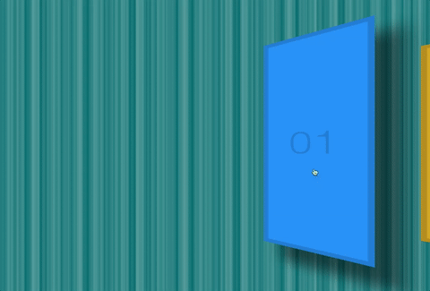

# Click and Drag to Scroll

The user can scroll through the app by clicking and moving cursor.

Live version: https://click-drag-scroll.herokuapp.com




## Tech stack
* Node
* Express
* Heroku
* Browsersync
* Vanilla JavaScript
* ES6
* Flexbox

## Getting started

```sh
git clone https://github.com/PiotrBerebecki/click-drag-scroll.git
cd click-drag-scroll
npm install

#1. Start the development server with Browsersync reloading
npm run dev

#2. Open this url in your browser: http://localhost:3000/public/index.html
```
